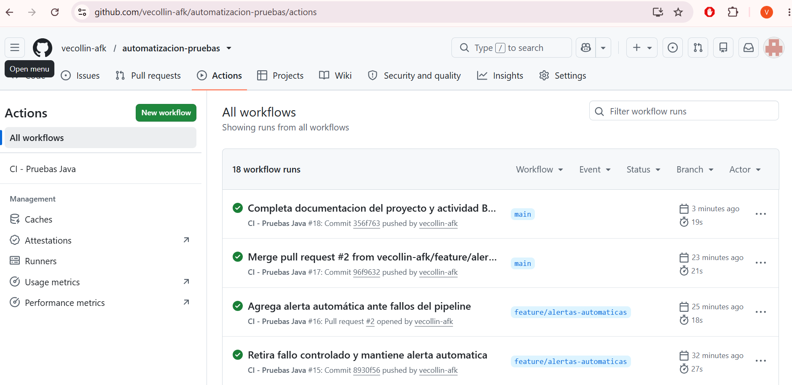
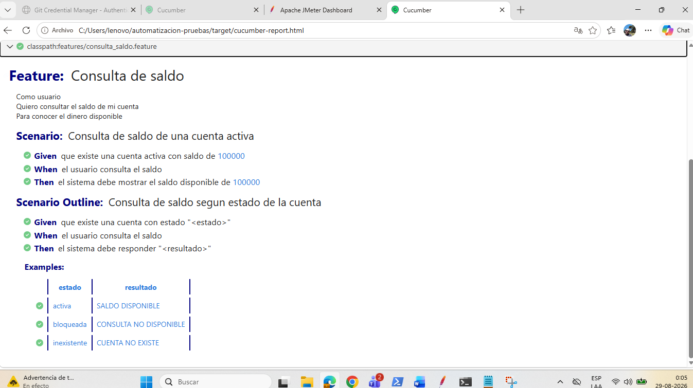
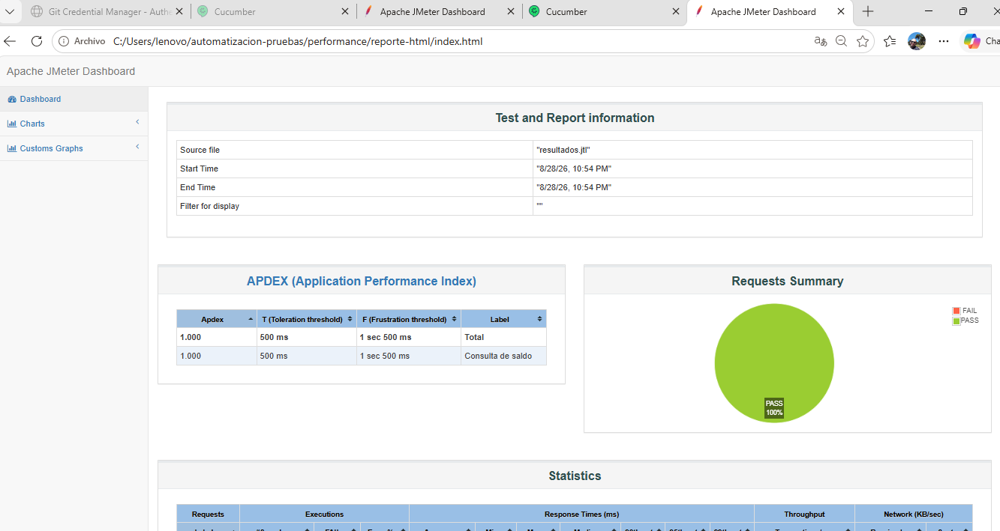
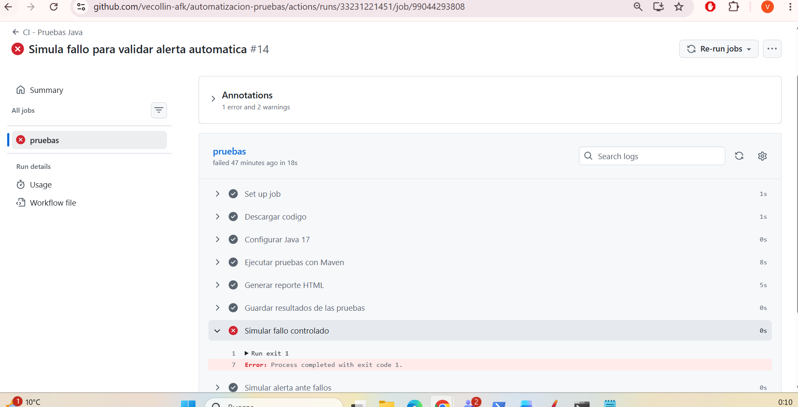
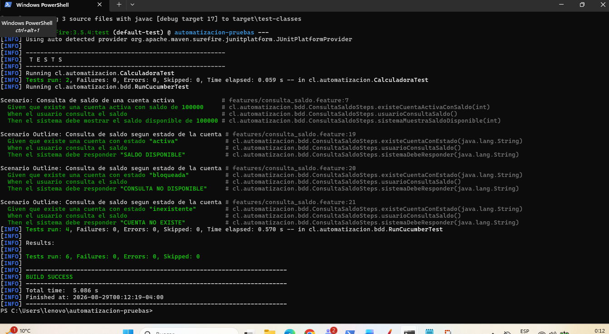

# Proyecto Automatización de Pruebas


## Objetivo


El objetivo de este proyecto es implementar un flujo de automatización de pruebas utilizando Java, Maven, JUnit, Cucumber, JMeter, Git y GitHub Actions.


La idea es que los cambios realizados en el proyecto puedan ser probados automáticamente, permitiendo detectar errores antes de incorporarlos a la rama principal.


También se incorporan pruebas BDD, pruebas de performance, reportes navegables y una simulación de alertas ante fallos del pipeline.


## Tecnologías utilizadas


- Java 17

- Maven

- JUnit 5

- Cucumber

- Gherkin

- Apache JMeter 5.6.3

- Git

- GitHub

- GitHub Actions


## Estructura del proyecto


```text

src/

├── main/

│   └── java/cl/automatizacion/

│       ├── Calculadora.java

│       ├── ConsultaSaldo.java

│       └── ServidorSaldo.java

│

├── test/

│   ├── java/cl/automatizacion/

│   │   ├── CalculadoraTest.java

│   │   └── bdd/

│   │       ├── ConsultaSaldoSteps.java

│   │       └── RunCucumberTest.java

│   │

│   └── resources/features/

│       └── consulta_saldo.feature

│

docs/

└── three-amigos.md


performance/

└── consulta_saldo.jmx


.github/workflows/

└── ci.yml
```

Archivos principales:


pom.xml

.gitignore

README.md

.github/workflows/ci.yml

## Pruebas unitarias


Se implementaron dos pruebas unitarias independientes utilizando JUnit 5:


Suma de dos números.

Resta de dos números.


Cada prueba se ejecuta de manera independiente y no depende del resultado de la otra.


Para ejecutar las pruebas localmente se utiliza:


mvn test


La ejecución completa del proyecto obtuvo:


Tests run: 6, Failures: 0, Errors: 0, Skipped: 0

BUILD SUCCESS

## Control de versiones


El proyecto utiliza Git para mantener un historial ordenado de los cambios realizados.


Se trabajó utilizando distintas ramas, entre ellas:


feature/configuracion-maven

feature/consulta-saldo-bdd

feature/alertas-automaticas


Los cambios fueron registrados mediante commits frecuentes y posteriormente integrados a la rama main mediante Pull Requests.


## Integración Continua


Se configuró un pipeline utilizando GitHub Actions.


El archivo utilizado es:


.github/workflows/ci.yml


El pipeline se ejecuta automáticamente ante eventos de push y pull_request.


El flujo realiza las siguientes acciones:


Descarga el código del repositorio.

Configura Java 17.

Ejecuta las pruebas con Maven.

Ejecuta los escenarios BDD.

Genera el reporte HTML de Surefire.

Guarda los reportes como artefactos de GitHub Actions.

Ejecuta una simulación de alerta si ocurre un fallo.

## Reporte de pruebas


Maven genera un reporte HTML mediante Surefire.


El reporte permite revisar:


Cantidad de pruebas ejecutadas.

Errores.

Fallos.

Pruebas omitidas.

Porcentaje de éxito.

Tiempo de ejecución.


Los reportes quedan almacenados como artefactos dentro del pipeline de GitHub Actions.


## Trabajo colaborativo - Three Amigos


Para la segunda parte del proyecto se simuló una sesión Three Amigos para la funcionalidad de consulta de saldo.


Participaron los siguientes roles:


Product Owner: define la necesidad del usuario y el resultado esperado.

QA: identifica los casos que deben ser probados.

Desarrollador: analiza la implementación y las validaciones necesarias.


Se definieron los siguientes criterios de aceptación:


Una cuenta activa debe permitir consultar el saldo.

Una cuenta bloqueada no debe mostrar el saldo.

Una cuenta inexistente debe indicar que la cuenta no existe.


La documentación completa se encuentra en:


docs/three-amigos.md

## Pruebas BDD


Se utilizó Cucumber y lenguaje Gherkin para implementar pruebas basadas en comportamiento.


El archivo de escenarios se encuentra en:


src/test/resources/features/consulta_saldo.feature


Se implementó:


Un escenario para una cuenta activa.

Un Scenario Outline con ejemplos para cuentas activas, bloqueadas e inexistentes.


Los step definitions se encuentran en:


src/test/java/cl/automatizacion/bdd/ConsultaSaldoSteps.java


La ejecución BDD obtuvo:


4 escenarios ejecutados

4 escenarios aprobados

100 % de éxito

## Reporte BDD


Cucumber genera un reporte HTML navegable en:


target/cucumber-report.html


Este reporte muestra los escenarios ejecutados, los pasos Given, When y Then, el resultado de cada prueba y el tiempo de ejecución.


El reporte también se guarda como artefacto del pipeline.


## Prueba de performance


Se implementó una prueba básica de performance utilizando Apache JMeter.


El archivo de configuración es:


performance/consulta_saldo.jmx


Para realizar la prueba se creó un servicio HTTP local que responde en:


http://localhost:8080/saldo


La clase utilizada es:


src/main/java/cl/automatizacion/ServidorSaldo.java


La prueba ejecutó 500 solicitudes de consulta de saldo.


Los principales resultados fueron:


Solicitudes ejecutadas: 500

Errores: 0

Error: 0,00 %

Tiempo promedio de respuesta: 0,89 ms

Mediana: 1 ms

Percentil 90: 2 ms

Percentil 95: 2 ms

Percentil 99: 4 ms

Tiempo máximo: 29 ms

Throughput: 111,71 transacciones por segundo

APDEX: 1,000

## Indicadores de performance


Los principales indicadores analizados fueron:


TPS / Throughput


Representa la cantidad de solicitudes que el sistema puede procesar por segundo.


En la prueba realizada se obtuvo aproximadamente:


111,71 transacciones por segundo

Latencia


Permite conocer cuánto demora el sistema en responder.


En esta prueba el tiempo promedio fue inferior a 1 ms y el 99 % de las respuestas se completó en 4 ms o menos.


Errores


Permite detectar solicitudes que no pudieron ser procesadas correctamente.


El resultado fue:


0,00 % de errores

## Dashboard de métricas


JMeter generó un dashboard HTML con los resultados de la prueba de performance.


El dashboard permite visualizar:


Cantidad total de solicitudes.

Solicitudes exitosas y fallidas.

Tiempo promedio de respuesta.

Percentiles.

Throughput.

Errores.

APDEX.

Gráficos de tiempos de respuesta y rendimiento.


Para las pruebas funcionales, GitHub Actions y los reportes de Surefire y Cucumber permiten visualizar el estado de las ejecuciones y descargar los resultados.


De esta forma se cuenta con información tanto funcional como de performance.


## Alertas automáticas


Se agregó una simulación de alerta en GitHub Actions.


La configuración utiliza:


if: failure()


Cuando alguna etapa del pipeline falla, se ejecuta un paso adicional que registra un mensaje de alerta en los logs.


Para comprobar su funcionamiento se realizó un fallo controlado utilizando:


exit 1


El pipeline falló de manera intencional y posteriormente ejecutó correctamente el paso:


Simular alerta ante fallos


Después de validar el comportamiento se eliminó el fallo controlado y se mantuvo solamente la configuración de alerta.


En un entorno real este mecanismo podría complementarse con notificaciones mediante correo electrónico, Microsoft Teams o Slack.


## Resultado final


El proyecto integra en un mismo flujo:


Control de versiones con Git.

Gestión de dependencias con Maven.

Pruebas unitarias con JUnit.

Pruebas BDD con Cucumber.

Integración continua con GitHub Actions.

Reportes HTML.

Pruebas de performance con JMeter.

Dashboard de métricas.

Simulación de alertas automáticas.

## Conclusión


Con este proyecto se implementó un flujo completo de automatización de pruebas, partiendo desde pruebas unitarias simples y avanzando hacia BDD, integración continua, pruebas de performance, métricas y alertas.


La automatización permite detectar errores de forma temprana, mantener trazabilidad de los cambios y entregar al equipo información clara sobre el estado de las pruebas antes de incorporar modificaciones a la rama principal.

## Evidencias

### Pipeline final en GitHub Actions



### Reporte BDD con Cucumber



### Dashboard de performance con JMeter



### Simulación de alerta ante fallos



### Ejecución local de pruebas


